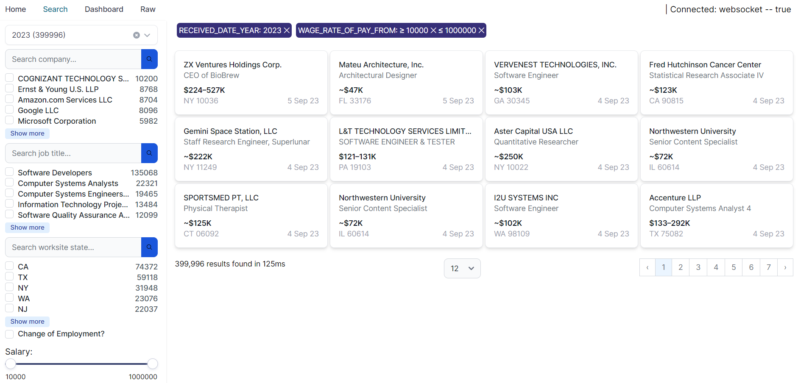
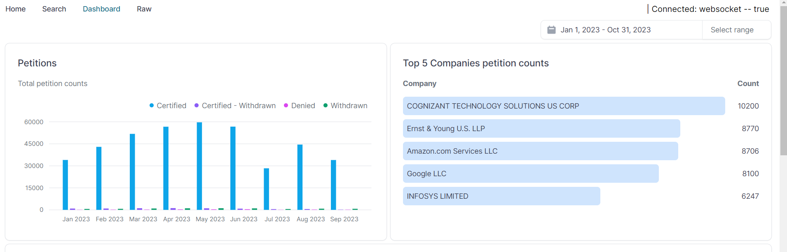

# HpqWeb

Welcome to the **Hpq Web** built to demonstrate the integration of **Tremor.js**, **DuckDB**, and **Algolia Search**. This project showcases a modern web application that leverages powerful data visualization, database management, and search functionalities.




## Table of Contents

- [Introduction](#introduction)
- [Features](#features)
- [Tech Stack](#tech-stack)
- [Getting Started](#getting-started)
  - [Prerequisites](#prerequisites)
  - [Installation](#installation)
  - [Running the App](#running-the-app)
- [Usage](#usage)
- [Contributing](#contributing)
- [License](#license)

## Introduction

This project is a demonstration of how to build a robust and scalable web application using Next.js. It integrates **Tremor.js** for data visualization, **DuckDB** for efficient data processing, and **Algolia Search** for fast and powerful search capabilities.

## Features

- **Next.js** for server-side rendering and static site generation.
- **Tremor.js** for interactive and visually appealing data visualizations.
- **DuckDB** for lightning-fast SQL queries and in-memory database management.
- **Algolia Search** for providing instant and highly relevant search results.
- Fully responsive design with modern UI/UX practices.

## Tech Stack

- **Framework**: [Next.js](https://nextjs.org/)
- **Data Visualization**: [Tremor.js](https://www.tremor.so/)
- **Database**: [DuckDB](https://duckdb.org/)
- **Search**: [Algolia Search](https://www.algolia.com/)
- **CSS Framework**: [Tailwind CSS](https://tailwindcss.com/)
- **Hosting**: [Netlify](https://netlify.com/)

## Getting Started

### Prerequisites

Before you begin, ensure you have the following installed:

- [Node.js](https://nodejs.org/) (v14.x or higher)
- [npm](https://www.npmjs.com/) or [Yarn](https://yarnpkg.com/)

### Installation

1. **Clone the repository:**

   ```bash
   git clone https://github.com/mnsrulz/hpqweb.git
   cd hpqweb
   ```

2. **Install dependencies:**

   ```bash
   npm install
   # or
   yarn install
   ```


### Running the App

To run the app in development mode, use:

```bash
npm run dev
# or
yarn dev
```

The app will be accessible at `http://localhost:3000`.

## Usage

- **Data Visualization with Tremor.js:**
  - The app demonstrates various components like charts, graphs, and metrics using Tremor.js.

- **Data Management with DuckDB:**
  - DuckDB is used for handling complex queries and data processing in-memory.

- **Search Functionality with Algolia:**
  - Instant and powerful search is enabled using Algolia Search, providing real-time search results.

## Contributing

Contributions are welcome! Please follow these steps:

1. Fork the repository.
2. Create a new branch (`git checkout -b feature-branch`).
3. Make your changes.
4. Commit your changes (`git commit -m 'Add some feature'`).
5. Push to the branch (`git push origin feature-branch`).
6. Open a pull request.

## License

This project is licensed under the MIT License. See the [LICENSE](LICENSE) file for details.